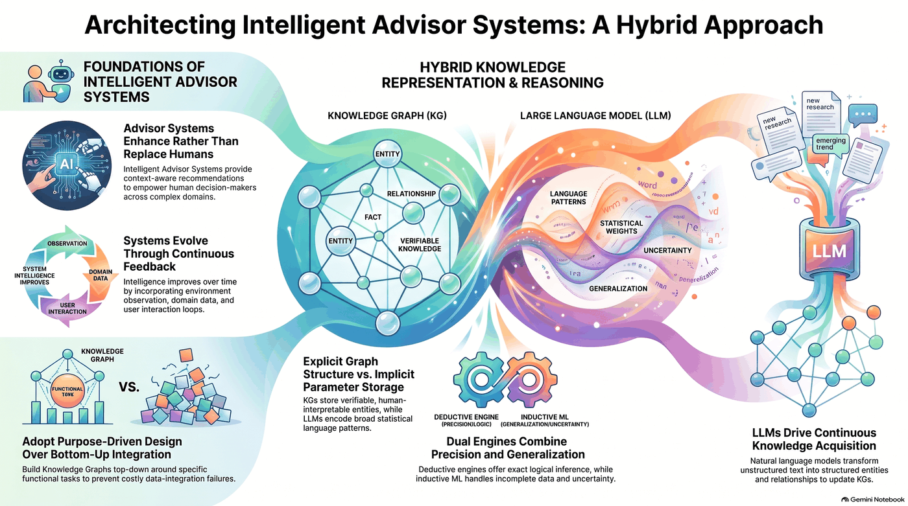
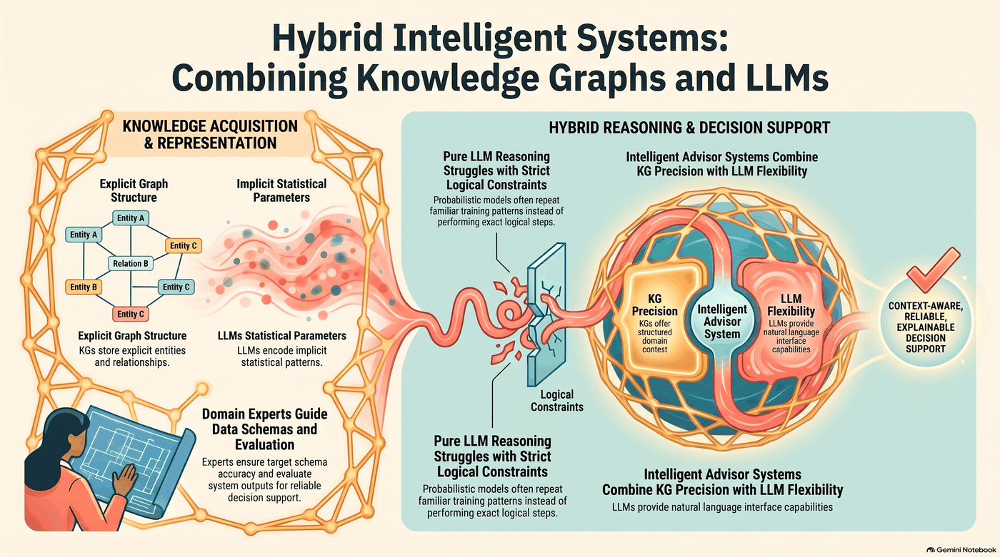

# Chapter 2: knowledge graphs and large language models

This chapter has no code to run. It sets up the idea behind the rest of the book: combining knowledge graphs (KGs)
with large language models (LLMs) in intelligent advisor systems. The `listings/` folder holds the two prompts
used as examples. Nothing needs to be installed.

## Background: intelligent advisor systems (recap of chapter 1)

An intelligent advisor system gives context-aware recommendations to help people make decisions in complex
domains. It supports the human rather than replacing them, and it improves over time through a feedback loop of
observing the environment, using domain data and learning from user interaction. The knowledge graph should be
built top-down around the functional task the advisor must perform, not by integrating every available data
source bottom-up.

## Knowledge graphs vs. LLMs

| | Knowledge graph | LLM |
|---|-----------------|-----|
| Representation | Explicit: entities, relationships and facts | Implicit: statistical weights learned from text |
| Strength | Verifiable, human-interpretable knowledge and exact (deductive) logical inference | Generalisation, handling incomplete data and uncertainty, natural-language interface |
| Weakness | Needs a schema and curated data | Can repeat familiar training patterns instead of doing exact logical steps |

The two are complementary. The KG supplies precision and structured domain context, the LLM supplies flexibility
and language understanding, and LLMs can in turn extract entities and relationships from unstructured text to keep
the KG up to date (the subject of the later chapters on building graphs with LLMs). Domain experts guide the target
schema and evaluate the system's outputs.

## The listings

Both files in [listings/](listings) are plain-text prompts to paste into a chat LLM. They are not executed by any
script. Listing 2.2 is not part of this repository.

| Listing | Prompt | What it demonstrates |
|---------|--------|----------------------|
| **2.1 ChatGPT example Prompt** | The LLM is a "virtual doctor". A patient reports a strong headache for a few days, forgetting things they have done and trouble speaking properly. What would it recommend? | A fluent, plausible medical answer from a general LLM. It reads well, but nothing in it is backed by a verifiable source, which is the motivation for grounding answers in a knowledge graph. |
| **2.3 Prompt for checking reasoning capabilities** | A farmer is at a river bank with a sheep. The boat holds one person and one animal. What is the smallest number of trips to get both across? | A logic puzzle used to probe reasoning. The correct answer is a single trip, since the boat fits one person and one animal. LLMs tend to answer with the longer classic river-crossing solution they have seen in training, an example of pure LLM reasoning struggling with strict logical constraints. |
