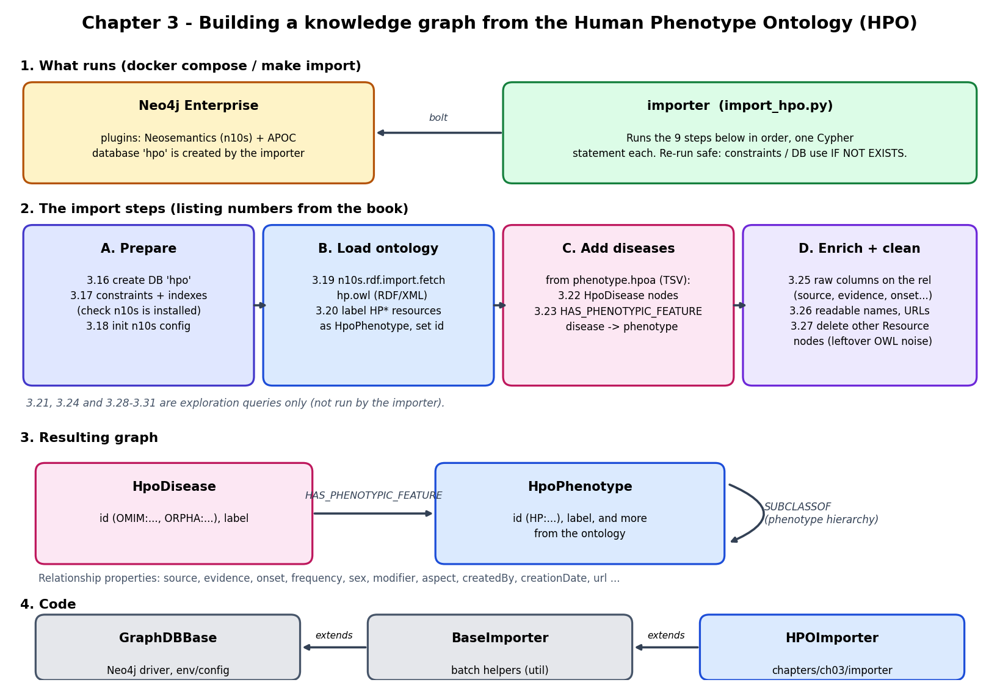
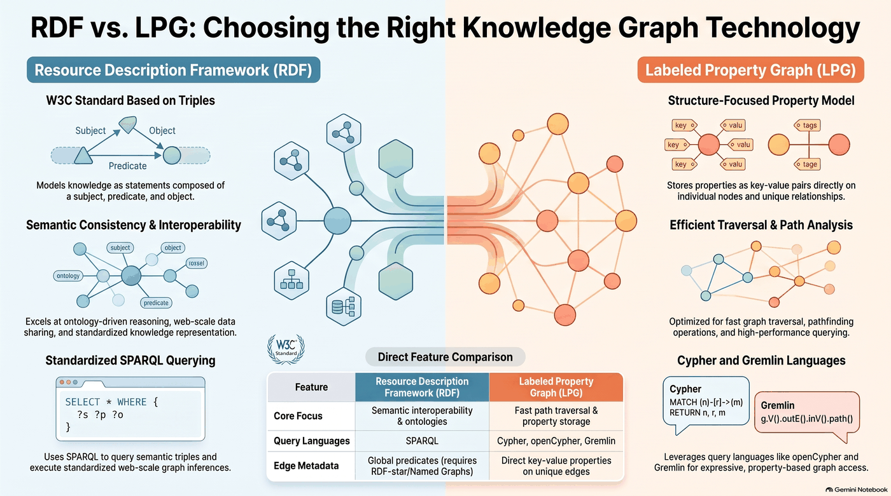
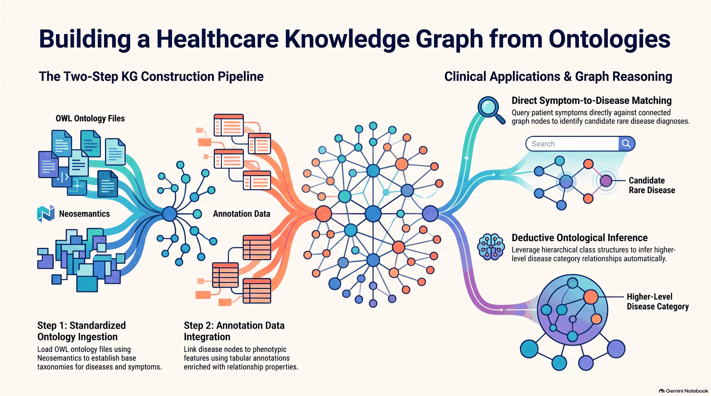

# Chapter 3: create your first knowledge graph from ontologies



This chapter builds a knowledge graph of rare diseases and their symptoms from the
[Human Phenotype Ontology (HPO)](https://hpo.jax.org). The ontology itself (phenotype terms and their hierarchy)
is loaded as RDF with the Neosemantics (n10s) plugin. The disease-to-phenotype annotations are then added from a
tab-separated file. The whole import is done by one script, `importer/import_hpo.py`, which runs one Cypher
statement per step.

## Getting started
The code provided in this chapter requires that you have installed the Neosemantics plugin in your Neo4j instance.

Neosemantics (n10s) is needed because the ontology is published as RDF (triples), while Neo4j is a labeled
property graph. The plugin converts between the two: `hp.owl` is first loaded as RDF and later reshaped into plain
nodes and relationships.



### Install requirements
This chapter's `Makefile` assumes you have a virtual environment folder called `venv` 
at the repository root folder. You can edit the`Makefile` and redefine the `PIP` variable
at the first line to match your configuration.
```shell
make init
```

### Download and import the datasets
Run this command to execute the importer code for each dataset.
```shell
make import
```

## Docker

```shell
cp .env.example .env   # set NEO4J_PASSWORD (8+ characters)
docker compose up --build
```

Starts Neo4j 5.26.0 Enterprise with the APOC and n10s plugins, then runs the importer against it. The Neo4j version
is pinned because n10s 5.26.0 crashes on newer 5.26.x patches. Enterprise is needed for `CREATE DATABASE`.
The data ends up in a database called `hpo` (browse it at http://localhost:7474).

## What the importer does

The import has two stages: ontology ingestion with Neosemantics (steps 3-5), then integration of the disease
annotation data (steps 6-10). The resulting graph supports symptom-to-disease matching and inference over the
phenotype hierarchy (listings 3.28-3.31).



`HPOImporter` (in [importer/import_hpo.py](importer/import_hpo.py)) calls its methods in this order. The `hpo`
database is created in the constructor. The listing numbers are the book's.

| # | Method | Listing | What it does |
|---|--------|---------|--------------|
| 0 | `__init__` | 3.16 | `CREATE DATABASE hpo IF NOT EXISTS`. |
| 1 | `set_constraints` | 3.17 | Unique constraints on `Resource.uri` (needed by n10s) and `Resource.id`; indexes on `HpoDisease.id` and `HpoPhenotype.id`. Already-existing rules are ignored, so the script can be re-run. |
| 2 | `check_neo_semantics` | - | Fails early with a clear message if `n10s.graphconfig.init` is not available (plugin not installed). |
| 3 | `initialize_neo_semantics` | 3.18 | Only if there are no `Resource` nodes yet: initialises n10s and sets `handleVocabUris: IGNORE` (no namespace prefixes on names) and `applyNeo4jNaming` (Neo4j-style labels and relationship types such as `SUBCLASSOF`). |
| 4 | `load_HPO_ontology` | 3.19 | `n10s.rdf.import.fetch` downloads `hp.owl` (RDF/XML) and turns it into `Resource` nodes and relationships. |
| 5 | `label_HPO_entities` | 3.20 | Resources whose URI starts with `http://purl.obolibrary.org/obo/HP` get the label `HpoPhenotype` and a readable `id` such as `HP:0000818` derived from the URI. |
| 6 | `create_disease_entities` | 3.22 | Reads `phenotype.hpoa` from the HPO GitHub releases (skipping the 5 header lines) and `MERGE`s one `HpoDisease` per distinct disease id (`OMIM:...`, `ORPHA:...`) with its `label`. |
| 7 | `create_rels_features_diseases` | 3.23 | For each row of the same file, connects the disease to the phenotype: `(HpoDisease)-[:HAS_PHENOTYPIC_FEATURE]->(HpoPhenotype)`. |
| 8 | `add_base_properties_to_rels` | 3.25 | Copies the other columns of each row onto that relationship when present: `source`, `evidence`, `onset`, `frequency`, `sex`, `modifier`, `aspect`, `biocuration`. |
| 9 | `enrich_with_descriptive_properties` | 3.26 | In batches of 1000 (`apoc.periodic.iterate`): extracts `createdBy` and `creationDate` from `biocuration`, adds readable names and descriptions for the evidence codes (IEA, PCS, TAS) and aspects (P = phenotypic abnormality, I = inheritance), and builds a `url` from PMID or OMIM sources. |
| 10 | `remove_unused_node` | 3.27 | In batches of 10000, `DETACH DELETE`s every `Resource` that is neither `HpoPhenotype` nor `HpoDisease`. These are leftover OWL annotation and axiom nodes that the earlier steps do not need. |

The resulting graph has `HpoDisease` and `HpoPhenotype` nodes, `SUBCLASSOF` relationships between phenotypes
(the HPO hierarchy), and `HAS_PHENOTYPIC_FEATURE` relationships carrying the evidence properties above.

## The Cypher listings

The files in [listings/](listings) are the book's Cypher snippets. The importer does not read them: each of
3.16-3.20, 3.22, 3.23 and 3.25-3.27 is copied into a method of `import_hpo.py` (see the table above). The rest are
exploration queries you run yourself in Neo4j Browser against the `hpo` database.

### Mirrored in the importer

| Listing | Notes |
|---------|-------|
| 3.16 create_database | Same statement as in `__init__`. |
| 3.17 create_db_constraints | Same four statements as `set_constraints`. |
| 3.18 initialize_neo_semantics | The three `n10s.graphconfig` calls. |
| 3.19 load_hpo_ontology | Fetches `hp.owl`. |
| 3.20 enrich_resource_node_with_abnormalities | Labels the HP resources as `HpoPhenotype` and sets `id`. |
| 3.22 create_disease_nodes | Creates the `HpoDisease` nodes. |
| 3.23 create_rels_phenotypes_diseases | Creates `HAS_PHENOTYPIC_FEATURE`. |
| 3.25 add_base_properties_to_rels | Adds the raw annotation columns to the relationship. |
| 3.26 enrich_with_descriptive_properties | Adds names, descriptions, dates and URLs. |
| 3.27 remove_unused_nodes | Deletes the other `Resource` nodes. |

### Exploration queries (run by hand)

| Listing | What it does |
|---------|--------------|
| **3.21 show_kg_at_the_current_stage** | After the ontology is loaded: shows the subclasses of "Diabetes mellitus" together with the OWL annotation nodes (`ANNOTATEDSOURCE`, `ANNOTATEDPROPERTY`, `HASSYNONYMTYPE`) around "Type I diabetes mellitus". This is the noise that step 10 later removes. |
| **3.24 explores_disease_phenotype_associations** | In this repo the file holds the same statement as 3.25 (setting the raw columns on the relationship), so it duplicates the importer step. |
| **3.28 phenotypes_associated_with_type_1_diabetes** | Returns the phenotypes of disease `OMIM:222100` (type 1 diabetes) as paths. |
| **3.29 diseases_associated_with_specific_features** | Takes five symptoms (growth delay, large knee, sensorineural hearing impairment, pruritus, type I diabetes mellitus) and returns the 5 diseases that share the most of them, with evidence names, sources, URLs and the matched features. |
| **3.30 subclasses_of_abnormality_of_endocrine_system** | Walks `SUBCLASSOF` 1 to 3 levels down from `HP:0000818` (abnormality of the endocrine system). |
| **3.31 features_related_to_abnormality_subclasses** | Uses `n10s.inference.nodesInCategory` to find every disease annotated with that category or any subcategory (`SUBCLASSOF` inference), and lists each disease's features. Skips 100 rows and returns 5. |

## Code

| Piece | File | Role |
|-------|------|------|
| `HPOImporter` | [importer/import_hpo.py](importer/import_hpo.py) | The importer described above. Run it with `make import` or the Docker setup. |
| `BaseImporter` | `util/base_importer.py` | Base class with batch-insert helpers (`batch_store`). `HPOImporter` only needs its connection setup. |
| `GraphDBBase` | `util/graphdb_base.py` | Opens the Neo4j driver from `NEO4J_URI`, `NEO4J_USER`, `NEO4J_PASSWORD` or `config.ini`. |
