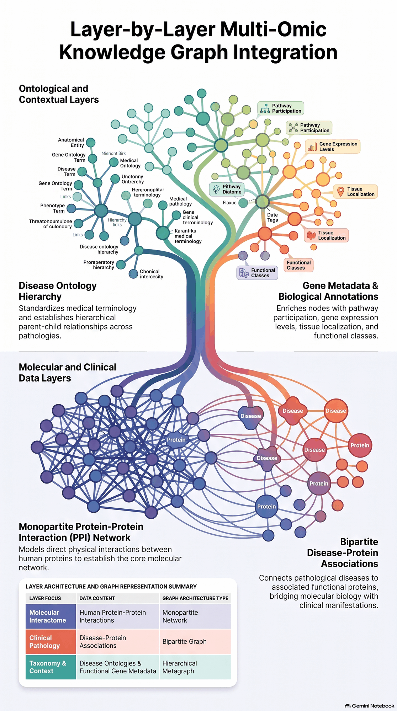
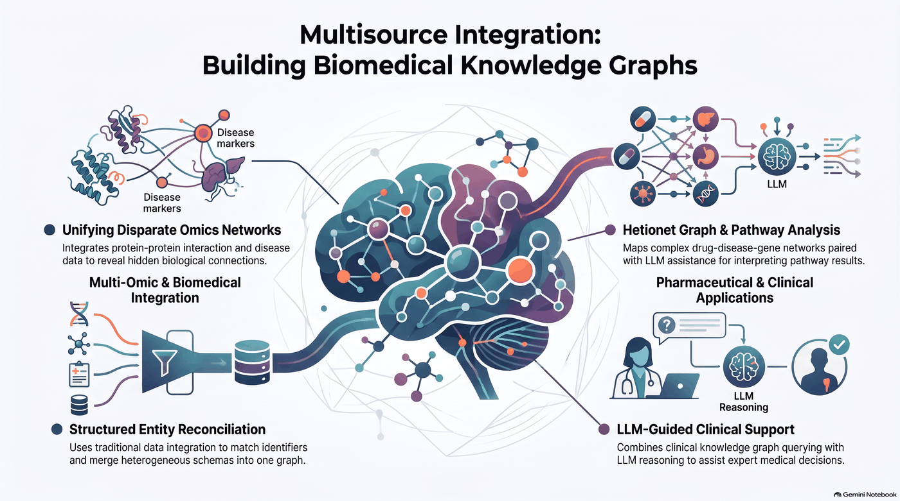
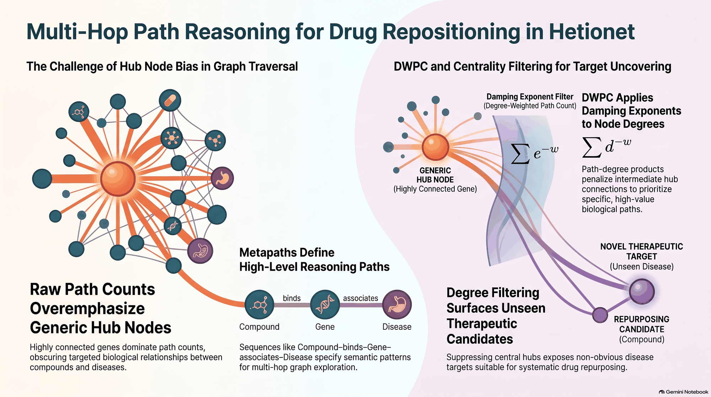

# Chapter 4: more complex knowledge graphs - biomedical examples


## Getting started

### Install requirements
This chapter's `Makefile` assumes you have a virtual environment folder called `venv` 
at the repository root folder. You can edit the`Makefile` and redefine the `PIP` variable
at the first line to match your configuration.
```shell
make init
```

### Download the PPi graph 
Run this command to initialize the graph content in your Neo4j database."
```shell
make import
```

### Launch the analysis scripts
To execute the analysis scripts, run the following command:
```shell
make analysis
```

This page describes the pipeline, the graph and the code. The code structure was derived from GitNexus (`cypher` over IMPORTS / CALLS / EXTENDS / HAS_METHOD edges
under `chapters/ch04`). The GitNexus index predates the `community_scores.py` refactor, so that module is taken
from the current source.

## What happens when you run it

Run with `docker compose up --build` (see `docker-compose.yml`) or with `make import` / `make analysis`.

| Step | Service / file | What it does |
|------|----------------|--------------|
| 1 | `neo4j` | Neo4j 5.26 Enterprise with the Graph Data Science (GDS) plugin and the seed-URI provider enabled. Enterprise is required because the chapter uses `CREATE DATABASE`. |
| 2 | `importer` -> `importer/import_seed.py` | Runs `CREATE DATABASE ppi ... seedUri: <backup URL>`, which restores a ready-made PPI graph into a database named `ppi` (listing 4.6). Alternative: build the graph by hand with listings 4.1-4.5. |
| 3 | `prepare` -> `prepare_gds.sh` | Waits until `ppi` is online, then runs listings 4.7-4.10: label every protein that has an interaction as `:PPIProtein`, project them into an in-memory undirected graph `ppi-graph`, run WCC (writes `componentId`) and Louvain (writes `componentLouvainId`). |
| 4 | `analysis` | Runs `louvain_cluster_analysis.py` and then `multiomic_analysis.py`. Each writes a PNG of three histograms into `analysis/`. |

## What the graph contains

- **`Protein`**: `id`, `name`, `description`. After step 3 also `componentId` (connected component) and
  `componentLouvainId` (Louvain community).
- **`Disease`**: `id`, `name`, `class`.
- **`(Disease)-[:ASSOCIATED_WITH]->(Protein)`**: proteins linked to a disease.
- **`(Protein)-[:INTERACTS_WITH]->(Protein)`**: a physical interaction between two proteins.

The idea of the chapter: if proteins behind the same disease (or the same Louvain community) interact mostly with
each other, they form a *module* in the network. The analysis scripts measure how module-like each group is.

### The multi-omic graph is built layer by layer



The chapter does not load one big dataset. It stacks data layers on top of each other, and each layer has its own
graph shape:

| Layer | Data | Graph shape |
|-------|------|-------------|
| Molecular interactome | Human protein-protein interactions | Monopartite network (`Protein` - `Protein`). This is the core of the graph. |
| Clinical pathology | Disease-protein associations | Bipartite graph (`Disease` - `Protein`). It connects molecular biology to clinical manifestations. |
| Taxonomy and context | Disease ontology and gene metadata | Hierarchical metagraph. The disease ontology gives standard terms and parent-child relations between diseases. Gene metadata adds pathway participation, expression levels, tissue localization and functional classes. |

In this repository the first two layers are the `Protein` and `Disease` nodes created by listings 4.1-4.5. The
disease classes (4.4) and gene names (4.5) are the first pieces of the ontology and metadata layer.

## How the Python code is organised

| Piece | File | Role |
|-------|------|------|
| `GraphDBBase` | `util/graphdb_base.py` | Opens the Neo4j driver. Reads `NEO4J_URI`, `NEO4J_USER`, `NEO4J_PASSWORD` from the environment, falling back to `config.ini`. Both analysis classes inherit from it. |
| `graph_undirected_from_cypher` | `util/networkx_utility.py` | Converts a Neo4j query result (`result.graph()`) into an undirected NetworkX graph. |
| `ClusterAnalysis` | `analysis/louvain_cluster_analysis.py` | One score row per Louvain community that has at least 3 proteins. |
| `MultiOmicAnalysis` | `analysis/multiomic_analysis.py` | One score row per disease, using that disease's associated proteins as the group. |
| `getCommunityScores`, `create_plot` | `analysis/community_scores.py` | Shared: compute the metrics for a group of proteins and draw the histograms. |

Both analysis classes have the same query helpers: `get_data` (query -> pandas DataFrame), `get_raw_data`
(query -> graph), `load_full_graph` and `load_graph_and_get_nx_graph` (query -> NetworkX graph).
They differ in what they select: `get_list_of_clusters` and `load_cluster_items` versus `get_list_of_diseases`
and `load_assoc_gene_vector`.

## The analysis algorithm in detail

1. Load the entire PPI graph from Neo4j into NetworkX once (`load_full_graph`).
2. Get the list of groups: Louvain clusters with 3 or more members, or all diseases.
3. For each group, build a 0/1 vector over the graph's nodes (1 = protein belongs to the group).
4. `getCommunityScores` slices the adjacency matrix with that vector and computes:
   - **Internal connectivity**: `density`, `average_degree`, `average_internal_clustering`.
   - **Connected components of the group**: size of the largest one, its share of the group
     (`percent_in_largest_connected_component`), and the number of components.
   - **External connectivity**: `expansion` (edges leaving the group per member) and `cut_ratio`.
   - **Combined**: `conductance` = leaving edges / (2 x internal edges + leaving edges) and `normalized_cut`.
     Low conductance means the group is well separated from the rest of the network.
5. Collect the rows in a DataFrame and save histograms of three metrics (largest-component share, density,
   conductance) to a PNG.
6. `multiomic_analysis.py` additionally recomputes size, density and conductance per disease with a second
   method, which extracts each disease subgraph from Neo4j (listing 4.12) and counts boundary edges (`compute_bd`).
   Its results go into a second DataFrame; only the first one is plotted.

Output files: `analysis/louvain_cluster_analysis_plot.png` and `analysis/pharma_analysis_plot.png`.

## Other biomedical graphs queried in the chapter (listings only)

The chapter's main idea is multisource integration: the PPI network is combined with disease data, and larger
biomedical graphs (Hetionet for drug-disease-gene pathways, CKG for clinical knowledge) are queried to reveal
connections that no single source shows. The results can then be interpreted with the help of an LLM.



These are Cypher listings in `listings/`, not driven by the Python code:

- **Hetionet** (4.16): `CREATE DATABASE hetionet` from a seed backup.
- **Celiac disease queries** (4.17-4.19): rank Gene Ontology biological processes with DWPC (degree-weighted path
  count). 4.17 uses Disease-Gene-Process paths. 4.18 adds gene-gene interactions, GWAS-sourced associations and
  tissue-specific upregulation. 4.19 returns the actual paths behind one result.
- **CKG** (4.20-4.21): `CREATE DATABASE ckg` from a seed backup, then a query for known protein-to-disease
  associations filtered by score and parent disease.

### Why the Hetionet queries use DWPC



The infographic explains the idea behind listings 4.17-4.19:

- **The problem is hub bias.** If you only count paths between a compound and a disease, highly connected genes
  dominate the count. They sit on a huge number of paths and hide the specific biological relationships.
- **A metapath fixes the shape of the path.** For example `Compound - binds - Gene - associates - Disease` says which
  node and edge types a path may use, so the multi-hop search follows a meaningful pattern.
- **DWPC (degree-weighted path count) damps the hubs.** Each path is weighted by the degrees of the nodes it passes
  through, raised to a negative damping exponent (`d^-w`). Paths through generic hubs count less, and paths through
  specific nodes count more.
- **The result is better drug repositioning candidates.** With the hubs suppressed, non-obvious targets rise in the
  ranking, such as a compound that could be repurposed for a disease it was not designed for.

## Notes from the code graph

- In `ClusterAnalysis`, `compute_Bd`, `compute_largest_components` and `load_hd` are defined but never called
  from the script's main flow.
- The two analysis classes are near-duplicates. A shared base class would remove the remaining duplication.
- The Louvain script depends on `componentLouvainId` and the `:PPIProtein` label, so the `prepare` step must run
  before `analysis`. Docker Compose enforces this order.

## Docker

```shell
cp .env.example .env   # set NEO4J_PASSWORD (8+ characters)
docker compose up --build
```

Runs Neo4j (with GDS), restores the `ppi` seed, computes WCC/Louvain communities, and writes the analysis
plots into `analysis/`.

## The Cypher listings

The files in [listings/](listings) are the chapter's Cypher snippets. They are **not executed by any script**:
run them by hand in Neo4j Browser or `cypher-shell`. Some are mirrored in code (noted below). The descriptions
below follow the book chapter ([context/from-simple-networks-to-multisource-integration.pdf](context/from-simple-networks-to-multisource-integration.pdf)),
including the numbers the book reports for each result.

Listings 4.1-4.12 run on the `ppi` database; 4.16-4.19 on `hetionet`; 4.20-4.21 on `ckg`.

**Numbering note.** In the book, listings 4.13-4.15 are Python (largest pathway component, density, conductance;
they live in `analysis/multiomic_analysis.py`), so they have no file in `listings/`. The book's listing 4.20 is an
LLM prompt, so the repo's `4.20` file is the book's **4.21** (CKG import) and the repo's `4.21` file is the book's
**4.22** (protein-disease associations). This page uses the repo file names.

### Building the PPI graph by hand (4.1-4.5)

Alternative to restoring the seed backup (4.6). Run in this order, with the CSV/TSV files from the SNAP dataset
decompressed into Neo4j's `import/PPI/` folder. Each import is a `LOAD CSV` wrapped in `CALL { ... } IN TRANSACTIONS
OF 100 ROWS`, which commits in batches so a large file does not exhaust memory.

| Listing | What it does |
|---------|--------------|
| **4.1 Create the constraints** | Makes `Protein.id` and `Disease.id` node keys (unique, not null, indexed), so the `MERGE` calls in the imports are fast and do not create duplicates. `IF NOT EXISTS` makes it safe to re-run. |
| **4.2 Import PPI Network** | Reads `bio-pathways-network.csv` (two protein IDs per row, no header) and `MERGE`s both proteins and a `(Protein)-[:INTERACTS_WITH]->(Protein)` relationship. The book's data (Menche et al., Chatr-Aryamontri et al.) has 21,559 proteins and 342,354 experimentally documented interactions. |
| **4.3 Import pathways** | Reads `bio-pathways-associations.csv` (DisGeNET: more than 21,000 protein-disease associations over 519 diseases with at least 10 disease proteins). Creates one `Disease` per row, splits the comma-separated `Associated Gene IDs` column with `UNWIND split(...)`, and links the disease to each protein with `ASSOCIATED_WITH`. This can add proteins that were not in the PPI file. |
| **4.4 Import disease classes** | Reads `bio-pathways-diseaseclasses.csv` and sets `class` on the existing `Disease` nodes (`MATCH` + `SET`, nothing new is created). Classes are the second level of the Disease Ontology: 10 categories, 290 of the 519 diseases are mapped (for example cancers 68, nervous system 44, cardiovascular 33, immune system 21). |
| **4.5 Import gene info** | Reads the tab-separated NCBI `gene_info` file and sets `name` (gene symbol) and `description` on the existing `Protein` nodes, so proteins can be read by name instead of by numeric gene ID. |

### Getting the database (4.6, 4.16, 4.20)

All three use `CREATE DATABASE ... OPTIONS { existingData: "use", seedUri: ... }` to restore a prebuilt backup
over HTTP. They need `dbms.databases.seed_from_uri_providers=URLConnectionSeedProvider` in `neo4j.conf` and
Neo4j Enterprise (the `CREATE DATABASE` command is Enterprise-only).

| Listing | Database | What it holds | Used in code |
|---------|----------|---------------|--------------|
| **4.6 Create the PPI database from a neo4j backup** | `ppi` | The graph that 4.1-4.5 build by hand. | Same statement is in `importer/import_seed.py`. |
| **4.16 Create the Het.io database** | `hetionet` | Hetionet (Himmelstein et al.): a heterogeneous network built from 29 public resources, linking compounds, diseases, genes, anatomies, pathways, biological processes, side effects, symptoms and more. The book uses it as a ready-made, well-designed schema to analyse. | No |
| **4.20 Importing CKG database** | `ckg` | The Clinical Knowledge Graph (Mann Lab), a proteomics and clinical KG, upgraded to a recent Neo4j version by the book's authors. | No |

### Community detection with Graph Data Science (4.7-4.11)

Run in the `ppi` database, in order. Mirrored by `prepare_gds.sh`, except 4.11. They need the GDS plugin. The
generic algorithms treat every node and relationship alike; the later listings add domain meaning.

| Listing | What it does |
|---------|--------------|
| **4.7 Creating a temporal label** | Adds the label `PPIProtein` to every protein with at least one interaction, so isolated proteins are left out of the projection. |
| **4.8 Create the graph projection in memory** | `gds.graph.project` builds an in-memory graph named `ppi-graph` from `PPIProtein` nodes and `INTERACTS_WITH`, treated as `UNDIRECTED`. Re-run it after a database restart, because 4.9 and 4.10 need it. |
| **4.9 Run WCC on the PPI Network** | Weakly connected components: proteins are grouped only because a path connects them. Writes `componentId` to each protein and returns the component count and size distribution. Book result: 21,559 proteins fall into 27 components, one giant one with 21,521 proteins and the rest single nodes or tiny islands. |
| **4.10 Run Louvain on the PPI Network** | Louvain community detection: maximises modularity, i.e. finds groups that are more densely connected inside than a random network would give. Writes `componentLouvainId`, which `louvain_cluster_analysis.py` reads. Book result: 48 communities, the largest above 3,500 proteins, mean about 450, modularity about 0.55 (the book's table shows 0.546; its text says about 0.40). |
| **4.11 Inspect the top 10 communities** | Takes the 10 largest communities by member count, then for each ranks members by number of interactions and returns the 20 most connected names (`keyMembers`). Inspection only. In the book, one large cluster has APP, NTRK1, GRB2, EGFR and HSP90AA1, another has ELAVL1, MOV10, NXF1, VCP and SHMT2. |

### Disease pathways (4.12)

| Listing | What it does |
|---------|--------------|
| **4.12 Extracting disease pathway** | For one disease (`$id`), collects its associated proteins and returns every `INTERACTS_WITH` relationship among them (`UNWIND` x `UNWIND` plus `OPTIONAL MATCH`; `DISTINCT` removes repeats). The result is the disease pathway H<sub>d</sub>: the subgraph of the PPI network induced by the disease's proteins. It is monopartite (no disease nodes) and pathways of different diseases may overlap. Same query as `load_hd` in the Python analysis classes. The book's Python listings 4.13-4.15 then score each pathway (largest connected component share, density, conductance). |

### Hetionet: ranking biological processes for celiac disease (4.17-4.19)

These use the **DWPC** (degree-weighted path count), inspired by the Thinklab project (Himmelstein). For each path
that follows a *metapath* (a fixed sequence of node and relationship types), the degrees of the nodes on the path
are raised to the power -0.4 and multiplied, which damps paths through highly connected hubs. The DWPC of a
(disease, process) pair is the sum over all such paths. `PC` is the plain path count and `n_genes` the number of
genes in the process. Celiac disease (CD) has 48 associated genes in Hetionet. Relationship names encode the
metaedge: `DaG` disease-associates-gene, `GpBP` gene-participates-biological process, `GiG` gene-interacts-gene,
`DlA` disease-localizes-anatomy, `AuG` anatomy-upregulates-gene.

| Listing | What it does |
|---------|--------------|
| **4.17 GO Process enrichment for celiac disease** | Metapath `Disease -DaG- Gene -GpBP- BiologicalProcess`. Computes the four node degrees along each path, then per Gene Ontology process the `PC` and `DWPC`. Keeps processes with at least 5 genes and at least 2 paths (so at least two celiac genes participate), top 10 by DWPC. Book result: led by *T cell costimulation* (DWPC 0.0335, PC 10) and *lymphocyte costimulation*. *Positive regulation of the immune system process* has the most paths (PC 21, 880 genes) but a low DWPC because it is generic, which is the point of the weighting. |
| **4.18 Tissue-specific interactomics** | Longer metapath `Disease -DaG- Gene -GiG- Gene -GpBP- BiologicalProcess`. Keeps only disease-gene links sourced from the GWAS Catalog (less biased by prior knowledge), and requires the second gene to be upregulated in an anatomy where the disease localizes (`exists((n0)-[:LOCALIZES_DlA]-()-[:UPREGULATES_AuG]-(n2))`). Processes limited to 5-100 genes and PC of at least 2. Top 10 by DWPC. Book result: the first two processes are unchanged, but glycoprotein biosynthesis and metabolism processes now appear, a more disease-specific signal. |
| **4.19 Paths behind the DWPC** | Returns the actual paths (not scores) from celiac disease to *positive regulation of glycoprotein biosynthetic process*, with the same filters as 4.18. Used to see why that process ranked highly. The book shows the result as a graph (figure 4.11). |

The book's exercise: change the disease name to repeat the analysis for other diseases.

### CKG: known protein-disease associations (4.21)

| Listing | What it does |
|---------|--------------|
| **4.21 Known protein to disease association** | Scenario: a clinical trial targets a set of proteins and some eligible patients have cardiomyopathy-related disease; are there known associations? Takes a hard-coded list of `GENE~UniProt` protein names, a minimum score of 3 and a parent disease (`DOID:0050700`, cardiomyopathy, from the Disease Ontology). Matches any relationship type between a protein and a disease, keeps those with `score` above the minimum where the disease is the parent or any descendant (`HAS_PARENT*0..`), and returns `node1`, `node2`, `weight`, `type` and `source` ordered by weight. Book result: ACTC1 is linked with score 5 (source DISEASES, type `ASSOCIATED_WITH`) to intrinsic, familial hypertrophic, hypertrophic, dilated and restrictive cardiomyopathy and left ventricular noncompaction. |

## Python scripts

| Script | What it does |
|--------|--------------|
| [importer/import_seed.py](importer/import_seed.py) | Restores the `ppi` database from the seed backup (listing 4.6). |
| [prepare_gds.sh](prepare_gds.sh) | Runs listings 4.7-4.10 against `ppi` (Docker only). |
| [analysis/louvain_cluster_analysis.py](analysis/louvain_cluster_analysis.py) | Scores every Louvain community with at least 3 proteins and plots the result. |
| [analysis/multiomic_analysis.py](analysis/multiomic_analysis.py) | Scores every disease's protein set and plots the result. |
| [analysis/community_scores.py](analysis/community_scores.py) | Shared scoring (density, conductance, largest connected component, ...) and plotting. |
