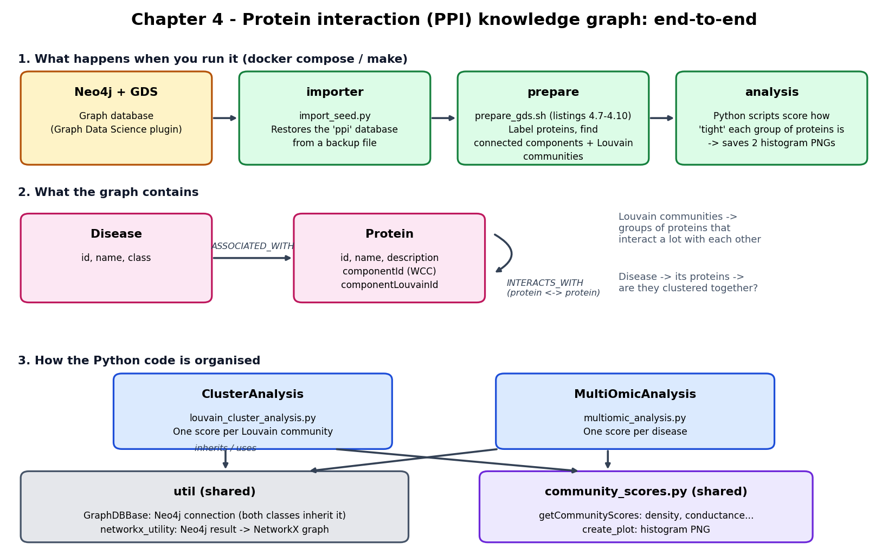

# Chapter 4: more complex knowledge graphs - biomedical examples




## Getting started

### Install requirements
This chapter's `Makefile` assumes you have a virtual environment folder called `venv` 
at the repository root folder. You can edit the`Makefile` and redefine the `PIP` variable
at the first line to match your configuration.
```shell
make init
```

### Download the PPi graph 
Run this command to initialize the graph content in your Neo4j database."
```shell
make import
```

### Launch the analysis scripts
To execute the analysis scripts, run the following command:
```shell
make analysis
```

This page describes the pipeline, the graph and the code. The code structure was derived from GitNexus (`cypher` over IMPORTS / CALLS / EXTENDS / HAS_METHOD edges
under `chapters/ch04`). The GitNexus index predates the `community_scores.py` refactor, so that module is taken
from the current source.

## What happens when you run it

Run with `docker compose up --build` (see `docker-compose.yml`) or with `make import` / `make analysis`.

| Step | Service / file | What it does |
|------|----------------|--------------|
| 1 | `neo4j` | Neo4j 5.26 Enterprise with the Graph Data Science (GDS) plugin and the seed-URI provider enabled. Enterprise is required because the chapter uses `CREATE DATABASE`. |
| 2 | `importer` -> `importer/import_seed.py` | Runs `CREATE DATABASE ppi ... seedUri: <backup URL>`, which restores a ready-made PPI graph into a database named `ppi` (listing 4.6). Alternative: build the graph by hand with listings 4.1-4.5. |
| 3 | `prepare` -> `prepare_gds.sh` | Waits until `ppi` is online, then runs listings 4.7-4.10: label every protein that has an interaction as `:PPIProtein`, project them into an in-memory undirected graph `ppi-graph`, run WCC (writes `componentId`) and Louvain (writes `componentLouvainId`). |
| 4 | `analysis` | Runs `louvain_cluster_analysis.py` and then `multiomic_analysis.py`. Each writes a PNG of three histograms into `analysis/`. |

## What the graph contains

- **`Protein`**: `id`, `name`, `description`. After step 3 also `componentId` (connected component) and
  `componentLouvainId` (Louvain community).
- **`Disease`**: `id`, `name`, `class`.
- **`(Disease)-[:ASSOCIATED_WITH]->(Protein)`**: proteins linked to a disease.
- **`(Protein)-[:INTERACTS_WITH]->(Protein)`**: a physical interaction between two proteins.

The idea of the chapter: if proteins behind the same disease (or the same Louvain community) interact mostly with
each other, they form a *module* in the network. The analysis scripts measure how module-like each group is.

## How the Python code is organised

| Piece | File | Role |
|-------|------|------|
| `GraphDBBase` | `util/graphdb_base.py` | Opens the Neo4j driver. Reads `NEO4J_URI`, `NEO4J_USER`, `NEO4J_PASSWORD` from the environment, falling back to `config.ini`. Both analysis classes inherit from it. |
| `graph_undirected_from_cypher` | `util/networkx_utility.py` | Converts a Neo4j query result (`result.graph()`) into an undirected NetworkX graph. |
| `ClusterAnalysis` | `analysis/louvain_cluster_analysis.py` | One score row per Louvain community that has at least 3 proteins. |
| `MultiOmicAnalysis` | `analysis/multiomic_analysis.py` | One score row per disease, using that disease's associated proteins as the group. |
| `getCommunityScores`, `create_plot` | `analysis/community_scores.py` | Shared: compute the metrics for a group of proteins and draw the histograms. |

Both analysis classes have the same query helpers: `get_data` (query -> pandas DataFrame), `get_raw_data`
(query -> graph), `load_full_graph` and `load_graph_and_get_nx_graph` (query -> NetworkX graph).
They differ in what they select: `get_list_of_clusters` and `load_cluster_items` versus `get_list_of_diseases`
and `load_assoc_gene_vector`.

## The analysis algorithm in detail

1. Load the entire PPI graph from Neo4j into NetworkX once (`load_full_graph`).
2. Get the list of groups: Louvain clusters with 3 or more members, or all diseases.
3. For each group, build a 0/1 vector over the graph's nodes (1 = protein belongs to the group).
4. `getCommunityScores` slices the adjacency matrix with that vector and computes:
   - **Internal connectivity**: `density`, `average_degree`, `average_internal_clustering`.
   - **Connected components of the group**: size of the largest one, its share of the group
     (`percent_in_largest_connected_component`), and the number of components.
   - **External connectivity**: `expansion` (edges leaving the group per member) and `cut_ratio`.
   - **Combined**: `conductance` = leaving edges / (2 x internal edges + leaving edges) and `normalized_cut`.
     Low conductance means the group is well separated from the rest of the network.
5. Collect the rows in a DataFrame and save histograms of three metrics (largest-component share, density,
   conductance) to a PNG.
6. `multiomic_analysis.py` additionally recomputes size, density and conductance per disease with a second
   method, which extracts each disease subgraph from Neo4j (listing 4.12) and counts boundary edges (`compute_bd`).
   Its results go into a second DataFrame; only the first one is plotted.

Output files: `analysis/louvain_cluster_analysis_plot.png` and `analysis/pharma_analysis_plot.png`.

## Other biomedical graphs queried in the chapter (listings only)

These are Cypher listings in `listings/`, not driven by the Python code:

- **Hetionet** (4.16): `CREATE DATABASE hetionet` from a seed backup.
- **Celiac disease queries** (4.17-4.19): rank Gene Ontology biological processes with DWPC (degree-weighted path
  count). 4.17 uses Disease-Gene-Process paths. 4.18 adds gene-gene interactions, GWAS-sourced associations and
  tissue-specific upregulation. 4.19 returns the actual paths behind one result.
- **CKG** (4.20-4.21): `CREATE DATABASE ckg` from a seed backup, then a query for known protein-to-disease
  associations filtered by score and parent disease.

## Notes from the code graph

- In `ClusterAnalysis`, `compute_Bd`, `compute_largest_components` and `load_hd` are defined but never called
  from the script's main flow.
- The two analysis classes are near-duplicates. A shared base class would remove the remaining duplication.
- The Louvain script depends on `componentLouvainId` and the `:PPIProtein` label, so the `prepare` step must run
  before `analysis`. Docker Compose enforces this order.

## Docker

```shell
cp .env.example .env   # set NEO4J_PASSWORD (8+ characters)
docker compose up --build
```

Runs Neo4j (with GDS), restores the `ppi` seed, computes WCC/Louvain communities, and writes the analysis
plots into `analysis/`.

## The Cypher listings

The files in [listings/](listings) are the chapter's Cypher snippets. They are **not executed by any script**:
run them by hand in Neo4j Browser or `cypher-shell`. Some are mirrored in code (noted below). Listings 4.13-4.15
are not part of this repository.

Listings 4.1-4.12 run on the `ppi` database; 4.16-4.19 on `hetionet`; 4.20-4.21 on `ckg`.

### Building the PPI graph by hand (4.1-4.5)

Alternative to restoring the seed backup (4.6). Run in this order, with the CSV/TSV files placed in Neo4j's
`import/PPI/` folder.

| Listing | What it does |
|---------|--------------|
| **4.1 Create the constraints** | Makes `Protein.id` and `Disease.id` node keys (unique, not null, indexed), so the `MERGE` calls in the imports are fast and do not create duplicates. |
| **4.2 Import PPI Network** | Reads `bio-pathways-network.csv` (two protein IDs per row) and `MERGE`s both proteins and a `(Protein)-[:INTERACTS_WITH]->(Protein)` relationship. Runs in batches of 100 rows. |
| **4.3 Import pathways** | Reads `bio-pathways-associations.csv`. Creates one `Disease` per row, splits the comma-separated `Associated Gene IDs` column, and links the disease to each protein with `ASSOCIATED_WITH`. |
| **4.4 Import disease classes** | Reads `bio-pathways-diseaseclasses.csv` and sets `class` on the existing `Disease` nodes. |
| **4.5 Import gene info** | Reads the tab-separated `gene_info` file and sets `name` (gene symbol) and `description` on the existing `Protein` nodes. |

### Getting the database (4.6, 4.16, 4.20)

All three use `CREATE DATABASE ... OPTIONS { existingData: "use", seedUri: ... }` to restore a prebuilt backup
over HTTP. They need `dbms.databases.seed_from_uri_providers=URLConnectionSeedProvider` in `neo4j.conf` and
Neo4j Enterprise.

| Listing | Database | Used in code |
|---------|----------|--------------|
| **4.6 Create the PPI database from a neo4j backup** | `ppi` | Same statement is in `importer/import_seed.py`. |
| **4.16 Create the Het.io database** | `hetionet` (Hetionet biomedical graph) | No |
| **4.20 Importing CKG database** | `ckg` (Clinical Knowledge Graph) | No |

### Community detection with Graph Data Science (4.7-4.11)

Run in the `ppi` database, in order. Mirrored by `prepare_gds.sh`, except 4.11.

| Listing | What it does |
|---------|--------------|
| **4.7 Creating a temporal label** | Adds the label `PPIProtein` to every protein with at least one interaction, so isolated proteins are left out of the projection. |
| **4.8 Create the graph projection in memory** | `gds.graph.project` builds an in-memory graph named `ppi-graph` from `PPIProtein` nodes and `INTERACTS_WITH`, treated as undirected. |
| **4.9 Run WCC on the PPI Network** | Weakly connected components. Writes `componentId` to each protein and returns the component count and size distribution. |
| **4.10 Run Louvain on the PPI Network** | Louvain community detection. Writes `componentLouvainId`, which `louvain_cluster_analysis.py` reads. Returns the community count and modularity. |
| **4.11 Inspect the top 10 communities** | For the 10 largest communities, lists up to 20 member names, most connected first. Inspection only. |

### Disease pathways (4.12)

| Listing | What it does |
|---------|--------------|
| **4.12 Extracting disease pathway** | For one disease (`$id`), collects its proteins and returns every `INTERACTS_WITH` relationship among them (`UNWIND` x `UNWIND` plus `OPTIONAL MATCH`). This is the disease's subgraph. Same query as `load_hd` in the Python analysis classes. |

### Hetionet: ranking biological processes for celiac disease (4.17-4.19)

These use the **DWPC** (degree-weighted path count) measure. For each metapath instance, the degrees of the
nodes on the path are raised to the power -0.4 and multiplied, which damps paths through highly connected hubs.
The DWPC of a (disease, process) pair is the sum over all such paths. `PC` is the plain path count.

| Listing | What it does |
|---------|--------------|
| **4.17 GO Process enrichment for celiac disease** | Paths `Disease -ASSOCIATES_DaG- Gene -PARTICIPATES_GpBP- BiologicalProcess`. Keeps processes with at least 5 genes and at least 2 paths, and returns the top 10 by DWPC. |
| **4.18 Tissue-specific interactomics** | Longer metapath `Disease - Gene - Gene - BiologicalProcess` using gene-gene interactions. Restricts disease-gene links to the GWAS Catalog source and requires the second gene to be upregulated in an anatomy where the disease localizes. Processes limited to 5-100 genes. Top 10 by DWPC. |
| **4.19 Paths behind the DWPC** | Returns the actual paths (not scores) for celiac disease and *positive regulation of glycoprotein biosynthetic process*, using the 4.18 filters. Used to see why that process ranked highly. |

### CKG: known protein-disease associations (4.21)

| Listing | What it does |
|---------|--------------|
| **4.21 Known protein to disease association** | Takes a hard-coded list of `GENE~UniProt` protein names, a minimum score of 3 and a parent disease (`DOID:0050700`). Returns each protein-disease association with score above the minimum, where the disease is the parent or one of its descendants (`HAS_PARENT*0..`). Output columns are `node1`, `node2`, `weight`, `type` and `source`, ordered by weight. |

## Python scripts

| Script | What it does |
|--------|--------------|
| [importer/import_seed.py](importer/import_seed.py) | Restores the `ppi` database from the seed backup (listing 4.6). |
| [prepare_gds.sh](prepare_gds.sh) | Runs listings 4.7-4.10 against `ppi` (Docker only). |
| [analysis/louvain_cluster_analysis.py](analysis/louvain_cluster_analysis.py) | Scores every Louvain community with at least 3 proteins and plots the result. |
| [analysis/multiomic_analysis.py](analysis/multiomic_analysis.py) | Scores every disease's protein set and plots the result. |
| [analysis/community_scores.py](analysis/community_scores.py) | Shared scoring (density, conductance, largest connected component, ...) and plotting. |
